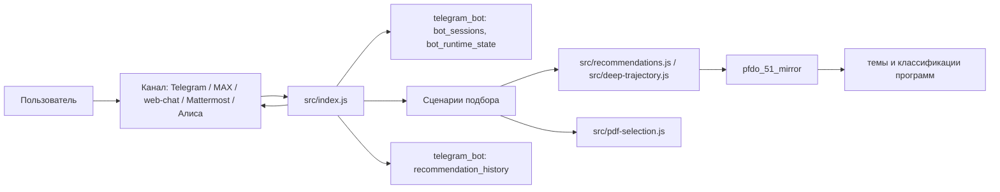

# Архитектура проекта

Статус: первый рабочий черновик от 2026-06-13.

Проект состоит из Node.js-бота, локальных баз PostgreSQL, PFDO-зеркала, скриптов загрузки и обработки данных, генератора PDF и отдельного сервиса извлечения тем из документов программ.

## Короткая схема



## Основные компоненты

| Компонент | Где находится | Ответственность |
| --- | --- | --- |
| Bootstrap и транспорты | `src/index.js` | Читает env, запускает HTTP-сервер или polling, обрабатывает входящие события. |
| Тексты сценариев | `src/flow.js` | Главное меню, вопросы, кнопки и базовые реплики. |
| Быстрый подбор | `src/description-flow.js`, `src/description-selection.js` | Разбор свободного текста, уточнение обязательных полей, запуск рекомендаций. |
| Пошаговый подбор | `src/index.js` | Состояния `s2_*`, вопросы и сбор профиля. |
| Углубленная траектория | `src/deep-trajectory.js` | Разбор PFDO-ссылок, профиль тем, поиск следующего шага. |
| Рекомендации | `src/recommendations.js` | Поиск программ, скоринг, нормализация карточек, fallback-логика. |
| PFDO-зеркало | `src/pfdo-mirror.js` | Чтение муниципалитетов, программ и detail payload из `pfdo_51_mirror`. |
| PFDO API config | `src/pfdo-config.js`, `src/pfdo.js` | Базовые URL, operator id и прямые API-запросы для импортных скриптов. |
| Сессии и история | `src/session-store.js` | Сохранение сессий, runtime state и истории рекомендаций. |
| PostgreSQL helper | `src/db.js` | Выполнение SQL через `psql`. |
| PDF | `src/pdf-selection.js` | Генерация PDF-файла с подборкой и QR-кодами. |
| Mattermost | `src/mattermost-transport.js` | WebSocket-подключение, получение сообщений, отправка ответов. |
| Извлечение тем | `services/program-topic-extractor/` | Парсинг документов программ, нормализация, классификация и auto-updater. |

## Runtime приложения

Бот написан на Node.js в формате CommonJS. В проекте нет web-фреймворка: HTTP webhook listener создается через стандартный модуль `node:http`.

При старте `src/index.js`:

1. Загружает `.env` через `src/load-env.js`.
2. Проверяет обязательные переменные для включенных транспортов.
3. Инициализирует базу `telegram_bot` через `db/schema.sql` и `db/seeds.sql`.
4. Загружает Telegram offset из `bot_runtime_state`, если Telegram включен.
5. Регистрирует webhook Telegram и MAX, если это разрешено конфигурацией.
6. Запускает Mattermost WebSocket, если включен.
7. Запускает HTTP-сервер, если нужен webhook, web-chat, Алиса, MAX или Mattermost.
8. Запускает Telegram polling, если Telegram включен не в webhook-режиме.

## Нормализация входящих событий

Все каналы приводятся к общей модели target:

- `platform` — канал (`telegram`, `max`, `web`, `mattermost`);
- `id` — идентификатор чата или клиента;
- дополнительные поля нужны транспорту для ответа.

Это позволяет хранить сессии по ключу `(platform, chat_id)` и использовать один сценарный код для разных каналов.

## Поток сценария 1: подбор по описанию

1. Пользователь выбирает «Подобрать по описанию».
2. Бот переводит сессию в `s1_wait_description`.
3. Пользователь пишет свободный текст.
4. `description-selection` извлекает возраст, место, интересы, бюджет, расписание, формат и ограничения.
5. Если включен `LOCAL_LLM_ENABLED`, свободный текст дополнительно отправляется в локальную модель через OpenAI-compatible endpoint.
6. Если не хватает обязательных полей, бот задает уточняющий вопрос.
7. Если профиль готов, бот показывает резюме или сразу запускает подбор.
8. `getRecommendations()` вызывается со строгим режимом `strict: true`.
9. Результат логируется в `recommendation_history`.
10. Пользователь может скачать PDF.

В строгом режиме бот не переходит к mock-каталогу, если PFDO-зеркало недоступно. Это защищает быстрый сценарий от выдачи демонстрационных данных.

## Поток сценария 2: пошаговый подбор

1. Пользователь выбирает «Подобрать с AI агентом».
2. Бот задает вопросы по возрасту, интересам, целям, расписанию, формату, месту и стоимости.
3. Пользователь может остановиться на базовом наборе параметров или уточнить группу, нежелательные форматы и направленность.
4. Бот строит профиль и вызывает `getRecommendations()`.
5. Если PFDO-зеркало недоступно, текущий код может перейти к mock-каталогу.
6. Результат логируется и может быть выгружен в PDF.

## Поток сценария 3: углубленная траектория

1. Пользователь присылает от 1 до 5 ссылок на программы `51.pfdo.ru`.
2. Бот извлекает program id из URL.
3. `deep-trajectory` загружает найденные программы из `pfdo_51_mirror`.
4. Бот собирает профиль пройденных тем по `pfdo_program_topic_aggregates` и `pfdo_program_topic_classifications`.
5. Если программы относятся к разным населенным пунктам, пользователь выбирает, где искать продолжение.
6. Если возраст нельзя вывести из программ, бот спрашивает возраст.
7. Кандидаты фильтруются по муниципалитету, возрасту и исключают уже пройденные программы.
8. Скоринг ищет совпадения по темам, категориям, направлению и признакам углубления.
9. Бот показывает программы, которые выглядят как следующий шаг.

## Данные и базы

### `telegram_bot`

Основная база приложения. Схема лежит в `db/schema.sql`.

| Таблица | Назначение |
| --- | --- |
| `bot_sessions` | Текущее состояние диалога по `(platform, chat_id)` и transport metadata пользователя. |
| `bot_runtime_state` | Runtime-состояние, например Telegram update offset. |
| `recommendation_history` | История рекомендаций, источник, confidence, payload результата и transport metadata пользователя. |

### `pfdo_51_mirror`

Локальное зеркало каталога PFDO. Схема описана в [pfdo-database-schema.md](pfdo-database-schema.md).

Ключевые группы таблиц:

- справочники регионов, муниципалитетов, направлений и форм обучения;
- программы, организации, адреса, группы и расписание;
- документы программ и локальные пути к файлам;
- извлеченные календарные темы;
- нормализации, агрегаты, классификации и очередь ручной проверки тем.

## PFDO-пайплайн данных

Данные PFDO обновляются скриптами из `scripts/`:

```bash
node scripts/import-pfdo-mirror.js
node scripts/download-pfdo-program-documents.js
node scripts/import-pfdo-calendar-topics.js --concurrency 4
node scripts/build-pfdo-topic-analytics.js
```

Извлечение и классификация тем подробнее описаны в [Program Topic Extractor](../services/program-topic-extractor/README.md).

## Генерация PDF

PDF создается модулем `src/pdf-selection.js`. Он:

- использует локальные шрифты из `assets/fonts/`;
- поддерживает кириллицу;
- создает карточки рекомендаций;
- добавляет QR-коды для ссылок на программы;
- сохраняет файл в `PDF_OUTPUT_DIR` или во временный каталог ОС.

Для web-chat PDF отдается через временный endpoint `GET /web-chat/document/<token>`. Время жизни ссылки задает `WEB_CHAT_DOCUMENT_TTL_MS`.

## Health endpoint

Если запущен HTTP-сервер, доступен:

```bash
GET /health
```

Ответ содержит `ok: true` и статусы транспортов:

```json
{
  "ok": true,
  "transports": {
    "telegram": "webhook",
    "max": "webhook",
    "alice": "webhook",
    "web": "enabled",
    "mattermost": "disabled"
  }
}
```

## Локальная LLM

Локальная модель включается переменной `LOCAL_LLM_ENABLED=true`. Она используется для анализа свободного текста в сценарии 1, если эвристикам нужна помощь.

Модель должна предоставлять OpenAI-compatible endpoint `/v1/chat/completions`. Код не обращается к OpenAI напрямую для пользовательского диалога.

OpenAI API используется отдельно в parser auto-updater для аудита извлечения тем программ. Это сервисный инструмент, а не часть пользовательского runtime.

## Основные точки расширения

| Нужно изменить | Смотрите |
| --- | --- |
| Тексты меню и кнопок | `src/flow.js` |
| Разбор свободного описания | `src/description-selection.js` |
| Логика быстрого сценария | `src/description-flow.js` |
| Вопросы пошагового сценария | `src/index.js`, состояния `s2_*` |
| Скоринг программ | `src/recommendations.js` |
| Углубленную траекторию | `src/deep-trajectory.js` |
| PDF-макет | `src/pdf-selection.js` |
| Новый канал | `src/index.js` и отдельный transport-модуль |
| Схему `telegram_bot` | `db/schema.sql` |
| Схему PFDO-зеркала | `db/pfdo-mirror-schema.sql` |

## Риски архитектуры

- `src/index.js` содержит много логики транспортов и сценария 2. При росте проекта его стоит разнести на модули.
- Доступ к PostgreSQL выполняется через `psql`, поэтому на сервере важна корректная настройка `PSQL_BIN`.
- Качество рекомендаций зависит от свежести `pfdo_51_mirror`.
- Углубленная траектория зависит от качества парсинга документов программ.
- Алиса пока не использует общий сценарный runtime.
- `Траектория новых интересов` есть в меню, но полноценный поток еще не реализован.

## Связанные документы

- [README](../README.md)
- [Обзор продукта](product-overview.md)
- [Рекомендательная логика](recommendation-engine.md)
- [PFDO-пайплайн данных](pfdo-data-pipeline.md)
- [Руководство оператора](operator-guide.md)
- [Справочник конфигурации](configuration-reference.md)
- [Схема PFDO-зеркала](pfdo-database-schema.md)
- [Program Topic Extractor](../services/program-topic-extractor/README.md)
