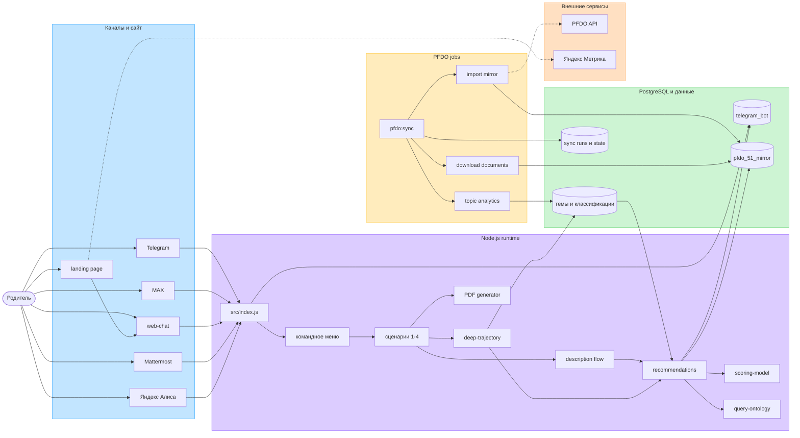
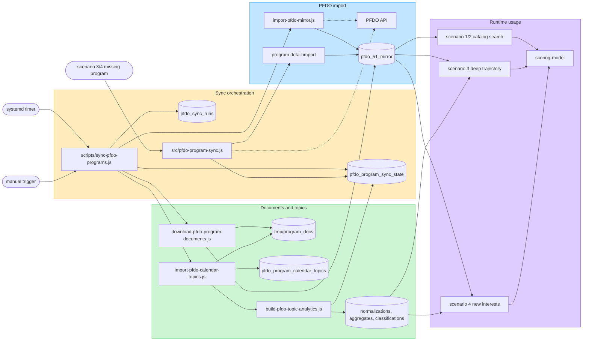
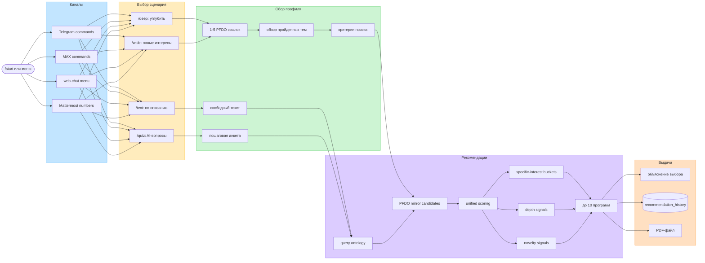

# FigJam-схемы проекта

Статус: подготовлено 2026-06-17 для обновления FigJam-доски.

Этот файл хранит актуальные Mermaid-источники схем проекта. Их можно вставить в FigJam через Mermaid/import diagram или сгенерировать через Figma `generate_diagram`.

## Runtime architecture

## PFDO data sync pipeline

## Scenario and recommendation flow

