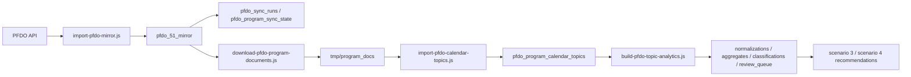

# PFDO-пайплайн данных

Статус: обновлено 2026-06-17 с учетом доработок за 2026-06-15 - 2026-06-17.

Документ описывает, как данные PFDO попадают в локальное зеркало, как из документов программ извлекаются темы и как эти данные становятся доступными для рекомендаций.

## Зачем нужен pipeline

Бот не должен зависеть от медленных или нестабильных запросов к публичному каталогу во время пользовательского диалога. Поэтому каталог PFDO зеркалируется в локальную PostgreSQL-базу `pfdo_51_mirror`.

Локальное зеркало дает:

- быстрый поиск программ;
- доступ к detail payload программ;
- историю raw-документов PFDO;
- локальные копии документов программ;
- извлеченные темы и классификации;
- воспроизводимость рекомендаций.

## Основная цепочка



## Шаг 1. Импорт зеркала PFDO

Команда:

```bash
node scripts/import-pfdo-mirror.js
```

Что делает:

- применяет `db/pfdo-mirror-schema.sql`;
- загружает регионы;
- загружает информацию об операторе;
- загружает муниципалитеты;
- загружает полезные контакты муниципалитетов;
- обходит муниципалитеты и карточки программ;
- загружает detail payload каждой программы;
- сохраняет направления, организации, адреса, модули, группы, расписание, педагогов и raw-документы.

Ключевые параметры:

- `PFDO_MIRROR_DATABASE_URL`;
- `PFDO_OPERATOR_ID`;
- `PFDO_IMPORT_CONCURRENCY`;
- `PFDO_IMPORT_SQL_FLUSH_BYTES`.

Рекомендуемый запуск полного цикла:

```bash
npm run pfdo:sync
```

Этот orchestrator запускает импорт PFDO, обновляет `pfdo_sync_runs` и `pfdo_program_sync_state`, скачивает документы, извлекает календарные темы и обновляет статусы обработки. Он используется для nightly sync на сервере.

Доступные параметры orchestrator:

```bash
node scripts/sync-pfdo-programs.js --trigger manual
node scripts/sync-pfdo-programs.js --trigger timer
node scripts/sync-pfdo-programs.js --skip-documents
node scripts/sync-pfdo-programs.js --skip-topics
node scripts/sync-pfdo-programs.js --concurrency 4
```

Проверка после импорта:

```bash
psql -d pfdo_51_mirror -c "select count(*) from pfdo_programs;"
psql -d pfdo_51_mirror -c "select count(*) from pfdo_program_groups;"
psql -d pfdo_51_mirror -c "select count(*) from pfdo_group_schedule_entries;"
psql -d pfdo_51_mirror -c "select id, run_type, status, started_at, finished_at from pfdo_sync_runs order by id desc limit 5;"
```

## Шаг 2. Скачивание документов программ

Команда:

```bash
node scripts/download-pfdo-program-documents.js
```

Что делает:

- читает URL документа из detail payload программы;
- скачивает документ в `tmp/program_docs`;
- добавляет поля документа в `pfdo_programs`;
- пишет manifest `tmp/program_docs/program_document_manifest.csv`;
- сохраняет ошибки скачивания в `program_document_download_error`.

Ключевые поля в `pfdo_programs`:

- `program_document_url`;
- `program_document_local_path`;
- `program_document_file_url`;
- `program_document_content_type`;
- `program_document_file_size`;
- `program_document_downloaded_at`;
- `program_document_download_error`.

Ключевые параметры:

- `PFDO_DOCUMENT_DOWNLOAD_CONCURRENCY`;
- `PFDO_DOCUMENT_DOWNLOAD_TIMEOUT_MS`;
- `PFDO_DOCUMENT_DOWNLOAD_ATTEMPTS`;
- `PFDO_DOCUMENT_DOWNLOAD_FORCE`.

Проверка:

```bash
psql -d pfdo_51_mirror -c "select count(*) from pfdo_programs where program_document_local_path is not null;"
psql -d pfdo_51_mirror -c "select count(*) from pfdo_programs where program_document_download_error is not null;"
```

## Шаг 3. Извлечение календарных тем

Команда:

```bash
node scripts/import-pfdo-calendar-topics.js --concurrency 4
```

Что делает:

- применяет `db/pfdo-mirror-schema.sql`;
- выбирает программы с локальным документом и без ошибки скачивания;
- извлекает текст через `services/program-topic-extractor`;
- ищет календарно-тематические и учебно-тематические планы;
- записывает строки в `pfdo_program_calendar_topics`;
- сохраняет source excerpt, метод извлечения, формат документа и confidence.
- после успешного импорта запускает частичную пересборку аналитики тем для обработанных программ, если не указан `--skip-analytics`.

Полезные режимы:

```bash
node scripts/import-pfdo-calendar-topics.js --limit 100
node scripts/import-pfdo-calendar-topics.js --program-id 364163
node scripts/import-pfdo-calendar-topics.js --program-ids exports/program_ids.csv
node scripts/import-pfdo-calendar-topics.js --keep-existing
node scripts/import-pfdo-calendar-topics.js --skip-analytics
```

Если `--keep-existing` не указан, скрипт удаляет старые строки для выбранного диапазона перед вставкой новых.

Проверка:

```bash
psql -d pfdo_51_mirror -c "select count(*) from pfdo_program_calendar_topics;"
psql -d pfdo_51_mirror -c "select extraction_method, count(*) from pfdo_program_calendar_topics group by extraction_method order by count(*) desc;"
```

## Шаг 4. Нормализация и классификация тем

Команда:

```bash
node scripts/build-pfdo-topic-analytics.js
```

Что делает:

- очищает производные таблицы аналитического слоя;
- нормализует каждую извлеченную тему;
- разделяет строки на `content`, `service` и `noise`;
- агрегирует темы по `program_id + normalized_topic_key + record_type`;
- классифицирует агрегаты;
- создает очередь ручной проверки;
- пишет CSV/JSON-экспорты в `exports/`.

Скрипт поддерживает частичную пересборку:

```bash
node scripts/build-pfdo-topic-analytics.js --program-id 364163
node scripts/build-pfdo-topic-analytics.js --program-ids exports/program_ids.csv
node scripts/build-pfdo-topic-analytics.js --skip-exports
node scripts/build-pfdo-topic-analytics.js --skip-schema
```

При частичной пересборке удаляются и создаются заново только записи выбранных программ в таблицах нормализаций, агрегатов, классификаций и очереди проверки.

Производные таблицы:

- `pfdo_program_topic_normalizations`;
- `pfdo_program_topic_aggregates`;
- `pfdo_program_topic_classifications`;
- `pfdo_program_topic_review_queue`;
- `pfdo_topic_classifier_golden_labels`.

Проверка:

```bash
psql -d pfdo_51_mirror -c "select count(*) from pfdo_program_topic_normalizations;"
psql -d pfdo_51_mirror -c "select record_type, count(*) from pfdo_program_topic_aggregates group by record_type;"
psql -d pfdo_51_mirror -c "select review_status, count(*) from pfdo_program_topic_review_queue group by review_status;"
```

## Шаг 5. Оценка классификатора

Команда:

```bash
node scripts/evaluate-pfdo-topic-classifier.js
```

Используйте ее после изменений в классификаторе или golden labels. Проверка помогает понять, не ухудшились ли категории тем.

## Parser auto-updater

Parser auto-updater нужен, когда строки в `pfdo_program_calendar_topics` не совпадают с текущим парсером или документом.

Dry-run:

```bash
node scripts/update-pfdo-program-parser.js \
  --program-ids exports/parser_update_programs.csv \
  --limit 1
```

Apply:

```bash
node scripts/update-pfdo-program-parser.js \
  --program-ids exports/parser_update_programs.csv \
  --apply
```

Важно:

- dry-run является режимом по умолчанию;
- `OPENAI_API_KEY` нужен для аудита;
- OpenAI возвращает оценку и repair plan;
- текущий поток не должен автоматически применять code patch;
- при локальной перезагрузке строк скрипт делает snapshot и verification;
- regression cases лежат в `services/program-topic-extractor/regression/checked-programs.csv`.

Артефакты:

- `exports/parser-updater-report.csv`;
- `exports/parser-updater-report.json`;
- `tmp/parser-updater/<program_id>/`.

## Как pipeline используется ботом

Обычный подбор читает:

- `pfdo_programs`;
- `pfdo_main_municipalities`;
- `pfdo_program_directions`;
- `pfdo_addresses`;
- keywords и detail payload.

Углубленная траектория дополнительно читает:

- `pfdo_program_topic_aggregates`;
- `pfdo_program_topic_classifications`.

Траектория новых интересов использует те же таблицы тем, но ищет не углубление, а новые содержательные категории.

Если аналитический слой тем пустой, обычный подбор продолжит работать, но сценарии 3 и 4 станут менее точными или попросят пользователя вручную уточнить интересы.

## Рекомендуемый порядок полного обновления

```bash
node scripts/import-pfdo-mirror.js
node scripts/download-pfdo-program-documents.js
node scripts/import-pfdo-calendar-topics.js --concurrency 4
node scripts/build-pfdo-topic-analytics.js
node scripts/evaluate-pfdo-topic-classifier.js
npm test
```

После этого выполните smoke-проверку бота через `/start`.

## Частичные обновления

Для одной программы:

```bash
node scripts/import-pfdo-calendar-topics.js --program-id 364163
node scripts/build-pfdo-topic-analytics.js --program-id 364163
```

Для списка программ:

```bash
node scripts/import-pfdo-calendar-topics.js --program-ids exports/program_ids.csv
node scripts/build-pfdo-topic-analytics.js --program-ids exports/program_ids.csv
```

Частичная пересборка удобна после on-demand импорта отдельных карточек или ручной проверки небольшого набора программ.

## Типовые сбои

| Симптом | Возможная причина | Что проверить |
| --- | --- | --- |
| Нет программ в зеркале | Не прошел импорт PFDO | `pfdo_programs`, логи `import-pfdo-mirror.js`, `PFDO_OPERATOR_ID`. |
| Нет документов | PFDO не отдал URL или скачивание упало | `program_document_download_error`, manifest в `tmp/program_docs`. |
| Нет тем | Документ не содержит распознаваемый план или парсер не справился | `source_excerpt`, `extraction_method`, warnings extractor-а. |
| Много `unknown_content` | Нужна донастройка классификатора или golden labels | `pfdo_program_topic_review_queue`. |
| Углубленная траектория пустая | Нет тем, нет совпадений по возрасту или муниципалитету | topic aggregates, program age range, municipality id. |
| Траектория новых интересов пустая | Все кандидаты повторяют изученную категорию или нет содержательных тем | level 2/level 1 классификации, `pfdo_program_topic_classifications`. |

## Что не хранить в репозитории

`tmp/` и `exports/` игнорируются через `.gitignore`. Это локальные артефакты pipeline, отчеты и кеши. Не коммитьте скачанные документы программ, OpenAI-cache и выгрузки с рабочими данными без отдельного решения.

## Связанные документы

- [Схема базы `pfdo_51_mirror`](pfdo-database-schema.md)
- [Атрибуты таблицы `pfdo_programs`](pfdo-programs-attributes.md)
- [Program Topic Extractor](../services/program-topic-extractor/README.md)
- [Рекомендательная логика](recommendation-engine.md)
- [Руководство оператора](operator-guide.md)
