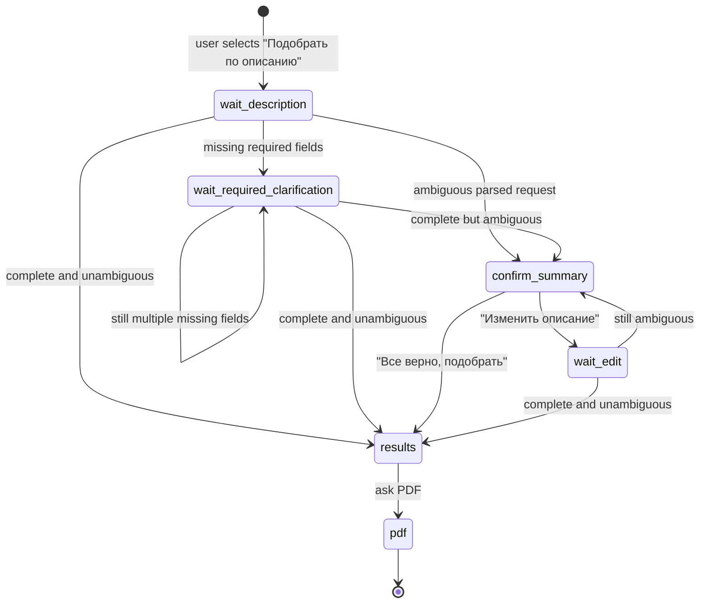

# feat: Реализовать быстрый подбор по описанию

**Target repo:** `telegram-bot`

## Overview

Нужно реализовать самостоятельный поток `Подобрать по описанию`: пользователь пишет один свободный запрос, бот извлекает обязательный минимум, при необходимости задает одно уточнение или показывает резюме при неоднозначности, затем выдает до 10 программ и предлагает PDF.

План намеренно не строит сценарий как расширение других пользовательских режимов. Допустимо использовать только общую инфраструктуру бота: сессии, транспортные отправители, каталог PFDO, рекомендации, логирование и генерацию PDF.

## Problem Frame

Сейчас в меню есть кнопка `Подобрать по описанию`, но пользовательский поток для нее не реализован. Сценарий должен дать быстрый путь для родителя, который уже может описать запрос своими словами и не хочет проходить пошаговый опрос.

Источник требований: `docs/scenario-1-description-flow.md`.

## Requirements Trace

- R1. Старт по кнопке `Подобрать по описанию`.
- R2. Бот принимает свободное описание одним сообщением.
- R3. Обязательный минимум для подбора: возраст, место поиска, интересы или направленность.
- R4. Если обязательных данных не хватает, бот задает одно общее уточнение по всем недостающим полям.
- R5. Если после уточнения остается одно недостающее поле, бот задает короткий вопрос только по нему.
- R6. Если данные неоднозначны, бот показывает краткое резюме и кнопки `Все верно, подобрать` / `Изменить описание`.
- R7. При правке бот обновляет только измененные поля, не сбрасывая весь запрос.
- R8. При достаточных данных бот показывает до 10 программ с адресом, расписанием, стоимостью, темами и ссылкой на запись.
- R9. Если точных совпадений мало или нет, бот не расширяет поиск автоматически и объясняет, какие критерии можно ослабить.
- R10. После выдачи бот предлагает скачать подборку PDF-файлом.

## Scope Boundaries

- Не менять продуктовую логику других пользовательских режимов.
- Не вводить новые таблицы: состояние сценария хранится в существующем JSON payload сессии.
- Не делать автоматическое расширение поиска при малом числе совпадений.
- Не делать отдельный многошаговый опрос: уточнения остаются короткими и свободными.
- Не требовать локальную LLM как обязательную зависимость: deterministic fallback должен работать сам.

## Context & Research

### Relevant Code and Patterns

- `src/flow.js`: главное меню и тексты пользовательских входов.
- `src/index.js`: транспортные обработчики, состояние сессии, callback routing, отправка сообщений и PDF.
- `src/session-store.js`: сохранение JSON-сессии без миграций.
- `src/recommendations.js`: подбор программ из PFDO mirror и формат данных программы.
- `src/llm-router.js`: уже есть optional LLM-анализ свободного текста, но сценарий 1 не должен зависеть от его доступности.
- `src/pdf-selection.js`: генерация PDF по объекту ответов и результату подбора.
- `src/pfdo-mirror.js`: доступ к муниципалитетам, программам и деталям программ.

### Institutional Learnings

- В `telegram-bot` нет отдельной локальной тестовой структуры. Для этого плана нужно добавить минимальные тесты рядом с реализацией, чтобы поток свободного описания не проверялся только вручную.
- `package.json` пока не содержит test script, поэтому план должен явно заложить тестовый entrypoint без добавления новых runtime-зависимостей.

### External References

- Внешние источники не использовались: задача опирается на локальный сценарный документ и существующую архитектуру бота.

## Key Technical Decisions

- Создать отдельный state namespace для сценария 1, например `descriptionSelection`, с шагами `s1_wait_description`, `s1_wait_required_clarification`, `s1_confirm_summary`, `s1_wait_edit`, `s1_results`, `s1_pdf`.
- Вынести разбор, объединение правок, проверку обязательных полей, неоднозначность и адаптеры результата в отдельный модуль `src/description-selection.js`.
- Использовать optional LLM только как enrichment. Если LLM отключена или вернула пустой результат, сценарий работает на rule-based извлечении.
- Добавить строгий режим подбора, который не скрывает пустой результат mock-подборкой и не расширяет критерии без согласия пользователя.
- Сделать callback-данные сценария 1 изолированными: `s1:confirm`, `s1:edit`, `s1:pdf:yes`, `s1:pdf:no`.
- Сохранить совместимость общих модулей: новые опции рекомендаций не меняют дефолтное поведение существующих вызовов.

## Open Questions

### Resolved During Planning

- Должны ли возраст, место и интересы быть обязательными: да, все три обязательны.
- Нужно ли показывать резюме всегда: нет, только при неоднозначности.
- Нужно ли автоматически расширять поиск: нет, бот показывает текущий результат и предлагает ослабить критерии.
- Сколько программ показывать: до 10 сразу.

### Deferred to Implementation

- Точные regex-правила для распознавания районов и организаций: их нужно уточнить по фактическим данным PFDO mirror во время реализации.
- Итоговые веса строгого ранжирования: должны остаться в пределах существующей модели рекомендаций, но могут потребовать небольшой настройки после тестов на реальных запросах.

## High-Level Technical Design

> Эта схема показывает целевой подход и нужна для проверки направления. Исполнитель должен воспринимать ее как контекст, а не как код для дословного воспроизведения.

## Implementation Units

- [ ] **Unit 1: Domain module for free-text description state**

**Goal:** Создать независимую доменную логику сценария 1: состояние, разбор текста, объединение уточнений, обязательные поля, неоднозначность, резюме и адаптер профиля для подбора.

**Requirements:** R2, R3, R4, R5, R6, R7

**Dependencies:** None

**Files:**
- Create: `src/description-selection.js`
- Modify: `src/llm-router.js`
- Modify: `package.json`
- Test: `test/description-selection.test.js`

**Approach:**
- В `src/description-selection.js` держать чистые функции без Telegram/MAX-зависимостей.
- Добавить минимальный test script на базе встроенного Node.js test runner, без новых npm-зависимостей.
- Состояние должно хранить исходное описание, список уточнений/правок, нормализованные поля и признаки неоднозначности.
- Rule-based parser должен извлекать возраст, интересы/направленность, место, бюджет, расписание, формат, ограничения и особенности.
- Optional LLM-анализ можно подключать поверх rule-based результата, но не как единственный источник.
- Merge-логика должна различать уточнение недостающих полей и правку уже распознанных данных.
- Модуль должен строить:
  - список недостающих обязательных полей;
  - текст общего уточнения;
  - текст короткого повторного вопроса по одному полю;
  - текст резюме;
  - recommendation profile;
  - объект answers для PDF.

**Patterns to follow:**
- Простые нормализаторы и enum-поля из `src/llm-router.js`.
- Профиль, который ожидает `src/recommendations.js`, но без зависимости от состояния других режимов.

**Test scenarios:**
- Happy path: текст `Сыну 10 лет, Североморск, робототехника после школы` -> обязательный минимум заполнен, неоднозначности нет, профиль содержит возраст, место, интересы и расписание.
- Happy path: текст с направленностью без явного интереса -> обязательный минимум считается заполненным через направленность.
- Edge case: текст содержит только `8 лет` -> missing prompt просит место и интересы/направление одним сообщением.
- Edge case: после первого уточнения остается только место -> модуль строит короткий вопрос только про место.
- Edge case: фраза `школьник, что-нибудь полезное, Мурманск` -> есть неоднозначность по возрасту и интересам, резюме не запускает подбор напрямую.
- Edge case: правка `не робототехника, а рисование` меняет интересы и сохраняет возраст/место.
- Error path: пустой текст или пробелы -> модуль возвращает понятный запрос на описание без падения.

**Verification:**
- Чистые функции покрыты тестами и не требуют токенов, базы или сетевого доступа.

- [ ] **Unit 2: Strict recommendation contract for exact scenario results**

**Goal:** Дать сценарию 1 режим подбора, который не расширяет поиск автоматически и не маскирует отсутствие точных совпадений mock-результатом.

**Requirements:** R8, R9

**Dependencies:** Unit 1

**Files:**
- Modify: `src/recommendations.js`
- Test: `test/recommendations-strict.test.js`

**Approach:**
- Добавить опции подбора для строгого режима, например поведение `no auto widen` и `no mock fallback on empty result`.
- Возвращать пустой результат с причиной, когда строгий поиск не дал программ, вместо исключения, которое уводит в fallback.
- Сохранить дефолтное поведение существующего API для вызовов без новых опций.
- Поддержать dependency injection источника каталога в тестах, чтобы проверять ранжирование и пустые результаты без реальной БД.
- Явно различать:
  - каталог недоступен;
  - каталог доступен, но кандидатов нет;
  - кандидаты есть, но отфильтрованы строгими условиями.

**Patterns to follow:**
- Текущий формат результата `source`, `confidence`, `items`, `municipality`.
- Существующие функции score/normalize в `src/recommendations.js`.

**Test scenarios:**
- Happy path: fake catalog возвращает 12 подходящих программ -> строгий режим отдает максимум 10 после сортировки.
- Edge case: fake catalog возвращает 2 подходящие программы -> результат содержит 2 элемента и признак малого числа совпадений.
- Edge case: fake catalog возвращает пустой список -> результат пустой, есть причина для пользовательского сообщения.
- Error path: fake catalog недоступен -> строгий режим сообщает ошибку каталога, не возвращая mock-программы.
- Integration: вызов без строгих опций сохраняет прежний fallback-контракт.

**Verification:**
- Строгий режим можно использовать для сценария 1 без изменения поведения остальных вызовов рекомендаций.

- [ ] **Unit 3: Transport-independent controller for scenario 1**

**Goal:** Реализовать state machine сценария 1 отдельно от Telegram/MAX транспорта, чтобы поток можно было тестировать без реальных webhook/polling update.

**Requirements:** R1, R4, R5, R6, R7, R8, R9, R10

**Dependencies:** Unit 1, Unit 2

**Files:**
- Create: `src/description-flow.js`
- Modify: `src/flow.js`
- Test: `test/description-flow.test.js`

**Approach:**
- `src/description-flow.js` должен принимать текущую сессию, входное событие и зависимости: отправка сообщений, редактирование сообщений, подбор, логирование, генерация PDF.
- `src/flow.js` должен хранить тексты входного сообщения, кнопки подтверждения/правки и кнопки PDF для сценария 1.
- Controller отвечает за переходы:
  - start -> ожидание описания;
  - описание -> уточнение / резюме / подбор;
  - уточнение -> повторная проверка;
  - подтверждение -> подбор;
  - правка -> повторная проверка;
  - результат -> PDF choice.
- Результат с малым числом программ форматируется как найденные варианты плюс совет ослабить критерии.
- Пустой результат форматируется как объяснение без автоматического расширения поиска.

**Patterns to follow:**
- Существующий `splitMessage`-подход для длинных сообщений.
- Существующий транспортный принцип: controller не знает, Telegram это или MAX.

**Test scenarios:**
- Happy path: start event задает шаг ожидания описания и отправляет стартовый текст.
- Happy path: полное описание без неоднозначности вызывает подбор и отправляет список программ плюс вопрос про PDF.
- Edge case: не хватает трех обязательных полей -> отправляется один общий prompt.
- Edge case: после уточнения все поля собраны -> controller запускает подбор, не спрашивая лишних вопросов.
- Edge case: неоднозначность -> отправляется резюме с двумя кнопками.
- Edge case: callback `s1:edit` переводит в ожидание правки и не сбрасывает состояние.
- Error path: recommendation service вернул ошибку каталога -> пользователь получает понятное сообщение, сессия остается в восстанавливаемом состоянии.
- Integration: PDF yes после результатов вызывает генератор PDF с answers из сценария 1.

**Verification:**
- Controller покрывает все состояния из `docs/scenario-1-description-flow.md` и не требует сетевого транспорта для тестов.

- [ ] **Unit 4: Wire scenario 1 into bot entrypoints**

**Goal:** Подключить самостоятельный controller сценария 1 к реальным message/callback обработчикам бота.

**Requirements:** R1, R2, R6, R7, R10

**Dependencies:** Unit 3

**Files:**
- Modify: `src/index.js`
- Modify: `src/flow.js`
- Test: `test/index-description-routing.test.js`

**Approach:**
- Обработать callback `scenario:description` как старт сценария 1.
- Направлять текстовые сообщения в controller, когда текущий шаг начинается с `s1_`.
- Направлять callback `s1:*` в controller.
- Добавить инициализацию `descriptionSelection` в новую сессию и при загрузке старой сессии, если поле отсутствует.
- Сделать `src/index.js` безопаснее для тестового импорта, если это понадобится для route-тестов: запуск транспорта должен оставаться только в runtime entrypoint.

**Patterns to follow:**
- Существующие `getSession`, `persistSession`, `resetSession`, `sendMessage`, `sendDocument`, `logRecommendation`.
- Существующий target abstraction для Telegram/MAX.

**Test scenarios:**
- Happy path: callback `scenario:description` вызывает старт сценария 1, а не generic selected message.
- Happy path: текст на шаге `s1_wait_description` уходит в controller.
- Happy path: callback `s1:confirm` уходит в controller и запускает подбор.
- Edge case: callback `s1:*` при отсутствующем состоянии просит начать заново.
- Integration: после `/start` сессия сбрасывается и старые данные сценария 1 не влияют на новый поток.

**Verification:**
- Кнопка из главного меню запускает реальный сценарий 1 в Telegram и MAX через общий обработчик.

- [ ] **Unit 5: Result formatting, history logging, and PDF parity**

**Goal:** Завершить пользовательский результат сценария 1: до 10 программ, сообщение о малом/пустом результате, логирование и PDF.

**Requirements:** R8, R9, R10

**Dependencies:** Unit 2, Unit 3, Unit 4

**Files:**
- Modify: `src/description-selection.js`
- Modify: `src/description-flow.js`
- Modify: `src/pdf-selection.js`
- Test: `test/description-result-output.test.js`

**Approach:**
- Формат результата должен содержать: название, адрес, расписание, стоимость, ссылку на онлайн-запись.
- Для малого результата добавлять короткую подсказку, какие критерии можно ослабить.
- Для пустого результата показывать объяснение и не предлагать фиктивные программы.
- Логировать подбор в `recommendation_history` с отдельным идентификатором сценария, например `description_selection`.
- PDF должен получать answers-объект со всеми полями, которые смог извлечь сценарий 1, и корректно отображать незаполненные необязательные поля.

**Patterns to follow:**
- Текущая структура элементов рекомендаций из `src/recommendations.js`.
- Текущий контракт `createSelectionPdf({ outputPath, answers, result })`.

**Test scenarios:**
- Happy path: 10 программ -> текст содержит 10 элементов и вопрос про PDF.
- Edge case: 2 программы -> текст содержит 2 элемента и подсказку про ослабление критериев.
- Edge case: 0 программ -> текст объясняет отсутствие результата и не показывает PDF как готовую подборку программ.
- Edge case: программа без тем -> текст использует безопасную фразу про уточнение тем в карточке.
- Integration: PDF answers содержит возраст, место, интересы, бюджет и расписание из свободного описания.
- Integration: history payload содержит исходное описание, уточнения, нормализованные параметры и результат подбора.

**Verification:**
- Пользователь получает одинаково понятный результат в чате и PDF, а история хранит достаточно данных для последующего анализа качества подбора.

- [ ] **Unit 6: Documentation and manual acceptance pass**

**Goal:** Синхронизировать документацию с реализованным поведением и описать ручную приемку.

**Requirements:** R1-R10

**Dependencies:** Units 1-5

**Files:**
- Modify: `docs/scenario-1-description-flow.md`
- Modify: `README.md`
- Test: `test/description-selection.test.js`
- Test: `test/description-flow.test.js`
- Test: `test/description-result-output.test.js`

**Approach:**
- Обновить сценарный документ только если реализация уточнила формулировки или технически невозможные edge cases.
- В README добавить короткую строку, что быстрый подбор по описанию реализован и какие данные нужны.
- Описать ручные приемочные кейсы без привязки к конкретному транспорту: полный запрос, неполный запрос, неоднозначность, правка, мало результатов, пустой результат, PDF.

**Patterns to follow:**
- Стиль `docs/scenario-1-description-flow.md`.
- Краткий формат README без длинной продуктовой спецификации.

**Test scenarios:**
- Test expectation: none -- документация не меняет runtime behavior; полнота проверяется через уже перечисленные unit/integration tests и ручную приемку.

**Verification:**
- Документация совпадает с фактическим потоком, а acceptance list покрывает все критерии готовности из origin document.

## System-Wide Impact

- **Interaction graph:** главный callback router и text handler получат новую ветку `s1_*`; остальные ветки должны остаться неизменными.
- **Error propagation:** ошибки каталога и PDF должны превращаться в пользовательские сообщения, а не в необработанные исключения.
- **State lifecycle risks:** частично заполненное описание должно сохраняться между сообщениями, но сбрасываться при `/start`.
- **API surface parity:** новые callback payloads нужны для Telegram и MAX, потому что оба транспорта используют общий inline keyboard abstraction.
- **Integration coverage:** unit tests чистых функций недостаточно; нужен controller test, который проверяет переходы сессии и вызовы зависимостей.
- **Unchanged invariants:** общий контракт сессий, транспортов и PDF остается совместимым; новые опции рекомендаций не меняют поведение вызовов без строгого режима.

## Risks & Dependencies

| Risk | Mitigation |
|------|------------|
| Rule-based parser неверно извлечет город, направление или ограничения | Держать parser чистым и покрытым тестами; использовать PFDO mirror для валидации места там, где это доступно |
| Пустой строгий результат случайно уйдет в mock fallback | Добавить отдельный strict contract в `src/recommendations.js` и regression test |
| `src/index.js` станет еще крупнее | Вынести state machine в `src/description-flow.js`, а в `src/index.js` оставить только маршрутизацию |
| PDF ожидает поля анкеты, которых нет в свободном описании | Сделать adapter answers в `src/description-selection.js` и безопасные fallback labels |
| MAX и Telegram по-разному передают callback payload | Использовать существующий общий reply_markup conversion и тестировать controller отдельно от транспорта |

## Documentation / Operational Notes

- Миграции БД не нужны.
- Новые env vars не нужны.
- Перед деплоем стоит проверить поток локально на Telegram polling или webhook, а затем отдельно убедиться, что MAX callbacks доходят с теми же `s1:*` payloads.
- После деплоя на сервер нужно проверить один полный запрос, один неполный запрос и PDF-выдачу.

## Sources & References

- Origin document: `docs/scenario-1-description-flow.md`
- Related code: `src/flow.js`
- Related code: `src/index.js`
- Related code: `src/recommendations.js`
- Related code: `src/llm-router.js`
- Related code: `src/pdf-selection.js`
- Related code: `src/session-store.js`
- Related config: `package.json`
