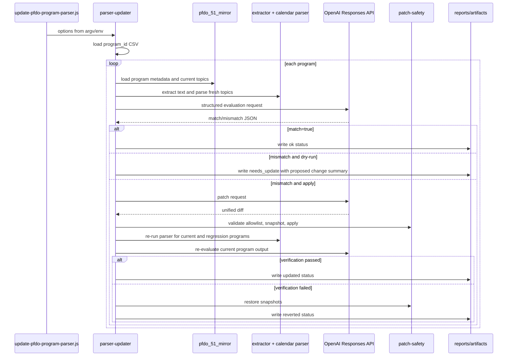

# feat: Add PFDO parser auto-updater

**Target repo:** `telegram-bot`

## Overview

Add a separate Node.js audit-and-update module for PFDO program document parsing. The module will read a CSV of `program_id` values, compare current `pfdo_program_calendar_topics` rows and fresh parser output against the source document with OpenAI, and automatically apply constrained parser patches only when `--apply` is explicitly set and verification passes.

The implementation should preserve the existing offline extractor/importer path. It should not update PostgreSQL topic rows directly; after a parser improvement is accepted, the existing `scripts/import-pfdo-calendar-topics.js` remains the import mechanism.

## Problem Frame

PFDO document parsing currently depends on a large rule-based parser in `services/program-topic-extractor/src/parsers/calendar-topics.js`. Some document layouts require iterative parser improvements, and manual diagnosis is slow. The requested module should automate the review loop: choose programs from CSV, ask OpenAI whether the parser/database topics match the document, and let OpenAI propose parser changes that are applied with hard safety checks.

Source design: `docs/superpowers/specs/2026-06-01-pfdo-parser-auto-updater-design.md`.

## Requirements Trace

- R1. Read a CSV list of program IDs from a `program_id` column.
- R2. For each program, load program metadata, local document path, current database topics, fresh parser output, and parser warnings.
- R3. Ask OpenAI to evaluate whether current topics match the document.
- R4. Skip parser updates when OpenAI reports the topics match.
- R5. When topics do not match, request a parser patch from OpenAI.
- R6. Apply generated patches automatically only with `--apply`; dry-run is the default.
- R7. Permit writes only to the parser allowlist, initially `services/program-topic-extractor/src/parsers/calendar-topics.js`.
- R8. Snapshot touched files before applying a patch and restore snapshots when verification fails.
- R9. Verify accepted patches against the current program and `services/program-topic-extractor/regression/checked-programs.csv`.
- R10. Write CSV/JSON reports and per-program artifacts with prompts, responses, patches, outputs, and verification summaries.
- R11. Treat OpenAI output as untrusted input: parse structured JSON strictly and reject invalid or out-of-allowlist patches.

## Scope Boundaries

- Do not rewrite the parser architecture in this iteration.
- Do not update `pfdo_program_calendar_topics` rows from the auto-updater.
- Do not deploy parser changes or touch Beget release scripts.
- Do not change topic normalization, classification, or analytics tables.
- Do not edit package metadata unless implementation later proves a dependency is unavoidable.
- Do not let OpenAI edit schema, importer, database helpers, deployment files, or unrelated source files.

### Deferred to Separate Tasks

- Expanding the writable allowlist beyond `calendar-topics.js`: separate design and review.
- Adding a persistent audit table for updater runs: separate database-change task.
- Training or replacing the rule parser with model-based extraction: separate architecture task.

## Context & Research

### Relevant Code and Patterns

- `services/program-topic-extractor/README.md`: documents the existing extractor/importer workflow and explicitly says the extractor does not normalize or classify topics.
- `services/program-topic-extractor/src/parsers/calendar-topics.js`: current calendar-topic parser and the only allowed writable parser file for v1.
- `services/program-topic-extractor/src/extractors/index.js`: existing text extraction entrypoint used by the importer.
- `scripts/import-pfdo-calendar-topics.js`: current program loading, text extraction, parser invocation, and database insertion pattern.
- `src/db.js`: existing `psql` wrapper, `queryRows`, SQL escaping helpers, and base64-safe text reading pattern.
- `src/load-env.js`: existing `.env` loader to reuse in the CLI wrapper.
- `services/program-topic-extractor/src/csv.js`: existing CSV parser/stringifier to reuse for input and reports.
- `services/program-topic-extractor/regression/checked-programs.csv`: existing parser regression guardrail.
- `test/*.test.js`: existing Node.js built-in test-runner pattern.

### Institutional Learnings

- The PFDO parser workflow already has known guardrails: validate representative documents before broad parser changes and preserve `unknown_content`/extraction failure states instead of hiding them.
- The workspace is not currently a git repository, so rollback cannot rely on `git checkout`. Snapshot restore must be implemented inside the updater.

### External References

- OpenAI Responses API supports model calls with text and structured JSON output.
- OpenAI Structured Outputs should be preferred over loose JSON mode when a schema can be supplied.
- OpenAI JavaScript SDK is officially supported, but this repository currently has no OpenAI dependency and runs on Node v24.14.0, so the first implementation can use built-in `fetch` against the REST API to avoid dependency churn.

## Key Technical Decisions

- Use a separate library module plus a thin CLI wrapper: keeps parser-update logic testable without invoking a real CLI or database.
- Use built-in `fetch` for OpenAI API calls in v1: avoids adding dependencies and fits the current CommonJS package.
- Use strict structured-output schemas for evaluation JSON: reduces brittle response parsing and makes invalid responses explicit failures.
- Request unified diff for patches, but validate paths before application: model output is treated as untrusted.
- Apply patches through a small patch application adapter: production can use the system `patch` command, while tests inject a fake applier.
- Snapshot files before every apply attempt: rollback must work without git.
- Re-run the parser directly for verification: the updater improves parser behavior, not database state.
- Keep dry-run as default: generated patches and mismatch reports can be inspected before enabling file writes.

## Open Questions

### Resolved During Planning

- Should the updater automatically apply changes? Yes, when `--apply` is provided.
- Should it update database topic rows directly? No, it only changes parser files and reports. Existing importer refreshes database rows.
- Should OpenAI be allowed to edit arbitrary project files? No, v1 allows only `services/program-topic-extractor/src/parsers/calendar-topics.js`.
- Can rollback rely on git? No, the current workspace is not a git repository.
- Should the implementation add the OpenAI SDK dependency? Not for v1 unless raw `fetch` proves insufficient during implementation.

### Deferred to Implementation

- Exact prompt wording and excerpt length: tune while implementing against real parser/document sizes.
- Exact confidence threshold for requesting a patch: start conservative and expose it as an internal constant or option if needed.
- Exact `patch` binary behavior on this machine: abstract command execution so implementation can adapt without changing module boundaries.

## Output Structure

```text
scripts/
  update-pfdo-program-parser.js
services/program-topic-extractor/src/auto-update/
  parser-updater.js
  openai-client.js
  patch-safety.js
  verification.js
test/
  parser-updater-input.test.js
  parser-updater-openai.test.js
  parser-updater-patch-safety.test.js
  parser-updater-verification.test.js
```

This tree is the intended shape. The implementing agent may merge tiny helper files if that keeps the module simpler, but the boundaries above should remain visible and testable.

## High-Level Technical Design

> This illustrates the intended approach and is directional guidance for review, not implementation specification. The implementing agent should treat it as context, not code to reproduce.



## Implementation Units

- [ ] **Unit 1: CLI and updater scaffold**

**Goal:** Create the command entrypoint, option parsing, run orchestration shell, CSV program ID loading, artifact directory setup, and report output scaffolding.

**Requirements:** R1, R6, R10

**Dependencies:** None

**Files:**
- Create: `scripts/update-pfdo-program-parser.js`
- Create: `services/program-topic-extractor/src/auto-update/parser-updater.js`
- Test: `test/parser-updater-input.test.js`

**Approach:**
- Reuse `src/load-env.js` in the script wrapper.
- Keep CLI parsing consistent with existing scripts: plain `process.argv`, `--help`, explicit numeric coercion, and clear errors for missing required values.
- Support the v1 CLI contract from the origin design: `--program-ids`, `--apply`, `--max-attempts`, `--model`, `--out-dir`, and `--limit`.
- Reuse `services/program-topic-extractor/src/csv.js` for input parsing and report stringification.
- Normalize all user-provided paths relative to the repo root, but store repo-relative paths in reports where possible.
- Export pure helpers for parsing options, loading program IDs, building report rows, and resolving artifact paths.
- Make `--apply` default to false and carry `dryRun` through the run context.

**Patterns to follow:**
- `scripts/import-pfdo-calendar-topics.js` for CLI shape, option parsing, and local default DB URL.
- `scripts/build-pfdo-topic-analytics.js` for report/export style.

**Test scenarios:**
- Happy path: CSV with `program_id` values `619196` and `1062482` loads two numeric IDs in order.
- Edge case: CSV has blank rows and duplicate IDs -> blanks are ignored and duplicates are processed once.
- Edge case: `--limit 1` trims the loaded program list after CSV parsing.
- Edge case: `--max-attempts 0` or a nonnumeric value is rejected before processing.
- Edge case: `--model` and `--out-dir` override defaults in the run context without starting a run.
- Error path: CSV missing `program_id` -> loader returns a clear configuration error before processing.
- Error path: `--apply` absent -> run context reports dry-run mode.

**Verification:**
- The CLI can be imported in tests without starting a run, and the scaffold can produce empty CSV/JSON reports without touching OpenAI, DB, or parser files.

- [ ] **Unit 2: Program context loading and parser snapshot**

**Goal:** Load all per-program context needed for evaluation: program metadata, current database topic rows, extracted document text, fresh parser rows, and warnings.

**Requirements:** R2, R10

**Dependencies:** Unit 1

**Files:**
- Modify: `services/program-topic-extractor/src/auto-update/parser-updater.js`
- Test: `test/parser-updater-input.test.js`

**Approach:**
- Use `src/db.js` `queryRows` with the existing base64 text pattern from importer scripts.
- Resolve the database URL from `PFDO_MIRROR_DATABASE_URL`, falling back to the same local `pfdo_51_mirror` URL used by `scripts/import-pfdo-calendar-topics.js`.
- Query `pfdo_programs` by ID and fail the program with status `failed` if the row or local document path is missing.
- Query `pfdo_program_calendar_topics` ordered by `topic_order`, returning compact row objects with topic names and hour fields.
- Use `extractDocumentText` and `extractCalendarTopicsFromText` exactly as `scripts/import-pfdo-calendar-topics.js` does.
- Build a focused document excerpt for model calls by finding likely planning sections and falling back to bounded head/middle snippets when no section is found.
- Write `before-parser-output.json` and context summaries into the per-program artifact directory.

**Patterns to follow:**
- `scripts/import-pfdo-calendar-topics.js` `loadPrograms`, `processProgram`, and `inferDocumentFormat` flow.
- `src/db.js` `queryRows` and base64-safe text decoding.

**Test scenarios:**
- Happy path: injected DB rows and extractor output produce a complete context object with metadata, DB topics, fresh topics, excerpt, and warnings.
- Edge case: program exists but has no `program_document_local_path` -> status is `failed` with a clear missing-document reason.
- Edge case: current DB topics are empty but fresh parser topics exist -> context still proceeds to evaluation.
- Error path: extractor throws -> program status is `failed` and the run continues to the next ID.
- Integration: parser invocation uses the same topic object shape as the importer path.

**Verification:**
- Program context loading can be tested with injected DB/extractor/parser dependencies and does not require a live database in unit tests.

- [ ] **Unit 3: OpenAI evaluation and patch request client**

**Goal:** Add a minimal OpenAI Responses API client and prompt builders for structured evaluation JSON and unified-diff patch proposals.

**Requirements:** R3, R4, R5, R11

**Dependencies:** Unit 2

**Files:**
- Create: `services/program-topic-extractor/src/auto-update/openai-client.js`
- Modify: `services/program-topic-extractor/src/auto-update/parser-updater.js`
- Test: `test/parser-updater-openai.test.js`

**Approach:**
- Use `OPENAI_API_KEY` and built-in `fetch` to call the Responses API.
- Default to a current configurable model through `--model` or env, without hardcoding model-specific behavior into parser logic.
- Send evaluation requests with `text.format` JSON schema so responses include required fields such as `match`, `confidence`, `missing_topics`, `extra_topics`, `wrong_hours`, `failure_mode`, and `recommended_parser_change`.
- Keep patch requests separate from evaluation requests. The patch response must be treated as raw text and later validated by `patch-safety`.
- Persist request/response JSON under the program artifact directory, redacting API keys and avoiding full unbounded document dumps in logs.
- Expose the OpenAI client behind an injectable interface so tests can use deterministic fake responses.

**Patterns to follow:**
- Existing CommonJS module style.
- Official OpenAI Responses API and Structured Outputs guidance for schema-shaped responses.

**Test scenarios:**
- Happy path: fake Responses API evaluation JSON parses into the expected internal evaluation object.
- Edge case: model returns `match=true` with low confidence -> updater records the confidence and does not request a patch unless configured threshold logic permits it.
- Error path: missing `OPENAI_API_KEY` in non-test runtime -> fatal configuration error before processing starts.
- Error path: response JSON is missing required fields -> evaluation fails for that program without applying a patch.
- Error path: patch response contains prose before/after the diff -> patch request result is rejected before file writes.

**Verification:**
- Unit tests prove OpenAI responses are parsed strictly and no patch is requested for matching programs.

- [ ] **Unit 4: Patch safety, application, and rollback**

**Goal:** Validate model-generated diffs, apply them only to allowlisted parser files, snapshot touched files, and restore snapshots on failure.

**Requirements:** R6, R7, R8, R11

**Dependencies:** Unit 3

**Files:**
- Create: `services/program-topic-extractor/src/auto-update/patch-safety.js`
- Modify: `services/program-topic-extractor/src/auto-update/parser-updater.js`
- Test: `test/parser-updater-patch-safety.test.js`

**Approach:**
- Parse unified diff headers to collect touched paths before applying anything.
- Accept only repo-relative paths that exactly match the writable allowlist.
- Reject absolute paths, parent-directory traversal, deleted files, binary patches, new files, and multi-file diffs in v1.
- Save snapshots of touched files into the program artifact directory before application.
- Apply patches through an adapter. The production adapter can use the system `patch` command from repo root; tests inject an in-memory or temp-file adapter.
- Restore snapshots when patch application, current-program verification, or regression verification fails.
- Record accepted, rejected, and reverted patch files with the reason.

**Patterns to follow:**
- No existing git dependency exists; use explicit file snapshots rather than repository commands.
- Existing code favors small plain Node.js helpers over new dependencies.

**Test scenarios:**
- Happy path: diff touching only `services/program-topic-extractor/src/parsers/calendar-topics.js` is accepted and snapshot metadata is produced.
- Edge case: diff uses `a/` and `b/` prefixes -> validator normalizes them to the allowlisted repo-relative path.
- Error path: diff touches `scripts/import-pfdo-calendar-topics.js` -> rejected before snapshots or writes.
- Error path: diff contains `../` or an absolute path -> rejected.
- Error path: patch adapter throws after snapshot -> restore writes the original file content back.
- Error path: model returns an empty diff -> rejected with a clear reason.

**Verification:**
- Tests cover validation and rollback without modifying real parser files.

- [ ] **Unit 5: Verification engine and regression guardrails**

**Goal:** Re-run parser checks after a candidate patch and decide whether to keep or revert the change.

**Requirements:** R8, R9, R10

**Dependencies:** Unit 4

**Files:**
- Create: `services/program-topic-extractor/src/auto-update/verification.js`
- Modify: `services/program-topic-extractor/src/auto-update/parser-updater.js`
- Test: `test/parser-updater-verification.test.js`

**Approach:**
- Current-program verification re-runs extraction/parser for the same program and asks OpenAI to re-evaluate the after-output against the document.
- Require either `match=true` after the patch or a conservative explicit improvement policy that does not introduce obvious extras.
- Regression verification reads `services/program-topic-extractor/regression/checked-programs.csv`.
- For each checked program, load the document path from DB, re-run extraction/parser, and compare topic count plus hour totals against expected CSV values.
- Treat missing regression documents as a verification failure in apply mode unless the row is explicitly skipped by a future option.
- Write `after-parser-output.json` and `verification-summary.json` for every attempted patch.

**Patterns to follow:**
- Existing regression CSV fields: `expected_topics_count`, `expected_hours_theory`, `expected_hours_practice`, `expected_hours_total`, `expected_source_section`.
- Importer topic row shape from `extractCalendarTopicsFromText`.

**Test scenarios:**
- Happy path: before mismatch becomes after match and regression totals match -> verification passes.
- Edge case: after output improves count but still has extra topics -> verification fails unless policy explicitly allows it.
- Error path: one regression program has a changed total hours value -> verification fails and reports the exact program ID and field.
- Error path: regression document cannot be loaded -> verification fails in apply mode.
- Integration: failed verification triggers snapshot restore through the patch-safety adapter.

**Verification:**
- Verification decisions are deterministic for injected parser outputs and do not require OpenAI in unit tests except through a fake evaluator.

- [ ] **Unit 6: End-to-end orchestration and documentation**

**Goal:** Connect the modules into a complete per-program processing loop, finish reports/artifacts, and document safe usage.

**Requirements:** R1, R3, R4, R5, R6, R9, R10, R11

**Dependencies:** Units 1-5

**Files:**
- Modify: `services/program-topic-extractor/src/auto-update/parser-updater.js`
- Modify: `services/program-topic-extractor/README.md`
- Test: `test/parser-updater-input.test.js`
- Test: `test/parser-updater-openai.test.js`
- Test: `test/parser-updater-patch-safety.test.js`
- Test: `test/parser-updater-verification.test.js`

**Approach:**
- Implement the main loop with bounded attempts per program.
- For `match=true`, write `ok` and continue.
- For mismatch in dry-run mode, write `needs_update`, store the evaluation, and do not request or apply a patch unless dry-run patch generation is intentionally enabled during implementation.
- For mismatch in apply mode, request a patch, validate, snapshot, apply, verify, and either keep `updated` or restore and write `reverted`.
- Continue processing after per-program failures; stop early only for fatal configuration errors.
- Write final `exports/parser-updater-report.csv` and `exports/parser-updater-report.json`.
- Update README with required env vars, CLI examples, dry-run/apply behavior, report paths, and the explicit warning that the existing importer must be run separately to refresh DB rows.

**Patterns to follow:**
- Existing script counters and JSON progress logs in `scripts/import-pfdo-calendar-topics.js`.
- Existing export naming conventions under `exports/`.

**Test scenarios:**
- Happy path: fake run with one matching program produces `ok` and no patch call.
- Happy path: fake apply run with one mismatch and passing verification produces `updated`.
- Edge case: dry-run mismatch produces `needs_update` and no file writes.
- Error path: invalid patch produces `failed` or `reverted` with a stored rejection reason.
- Error path: patch applies but regression fails -> snapshots are restored and report status is `reverted`.
- Integration: processing multiple program IDs continues after one failed program and final counters match per-status rows.

**Verification:**
- The updater can complete a dry-run on a one-row CSV without writing parser files.
- In apply mode, every accepted file write is paired with artifact evidence and either passing verification or snapshot restore.

## System-Wide Impact

- **Interaction graph:** New CLI and library call existing DB helper, extractor, parser, OpenAI API, patch adapter, and report writer. Existing bot runtime paths are not called.
- **Error propagation:** Per-program errors become report rows; fatal environment errors stop the run before processing starts.
- **State lifecycle risks:** Partial patch application is the main risk. Snapshots and verification-triggered restore are required for every apply attempt.
- **API surface parity:** Existing extractor/importer APIs should remain compatible. Parser output shape must not change except through intentional parser fixes.
- **Integration coverage:** Unit tests should fake DB/OpenAI/parser dependencies, while a manual dry-run validates actual local wiring before apply mode.
- **Unchanged invariants:** The updater does not write database topic rows, does not deploy, and does not change classifier behavior.

## Risks & Dependencies

| Risk | Mitigation |
|------|------------|
| OpenAI proposes unsafe or unrelated code changes | Strict patch allowlist, diff validation, dry-run default, snapshots, and regression checks |
| Parser change fixes one document but regresses known cases | Mandatory regression verification against `checked-programs.csv` before keeping patches |
| Workspace has no git rollback | Snapshot touched files before every patch and restore from snapshots on failure |
| Model evaluation is overconfident or wrong | Require after-change verification, keep artifacts for review, and use conservative thresholds |
| Long documents exceed useful prompt size | Build focused excerpts around planning sections and store full parser outputs locally instead of sending unbounded text |
| OpenAI API or network fails mid-run | Mark current program failed, keep artifacts, and continue unless configuration is invalid |
| System `patch` behavior differs by platform | Hide patch execution behind an adapter and test validator/rollback separately |

## Documentation / Operational Notes

- README should explain dry-run first, then apply mode.
- README should state that `OPENAI_API_KEY` must be set and must not be committed.
- Generated artifacts may contain document excerpts and model outputs, so keep them under `tmp/parser-updater` and avoid publishing them accidentally.
- After an accepted parser update, run the existing calendar-topic importer separately for affected programs or the full mirror, depending on the desired DB refresh scope.
- Because there is no git repository at this workspace path, users should keep an external backup or initialize version control before broad apply runs.

## Sources & References

- Origin document: `docs/superpowers/specs/2026-06-01-pfdo-parser-auto-updater-design.md`
- Existing parser: `services/program-topic-extractor/src/parsers/calendar-topics.js`
- Existing importer: `scripts/import-pfdo-calendar-topics.js`
- Existing DB helper: `src/db.js`
- Existing CSV helper: `services/program-topic-extractor/src/csv.js`
- Existing regression CSV: `services/program-topic-extractor/regression/checked-programs.csv`
- OpenAI Responses API: `https://platform.openai.com/docs/api-reference/responses`
- OpenAI Structured Outputs: `https://platform.openai.com/docs/guides/structured-outputs`
- OpenAI JavaScript libraries: `https://platform.openai.com/docs/libraries`
